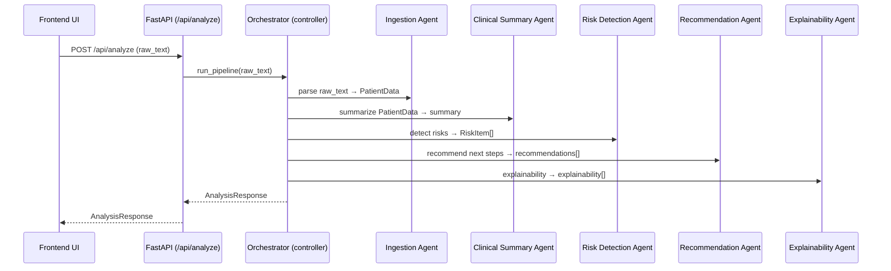

# CLINIX Master Doc (Agent Flow + Features)

This is the canonical reference for CLINIX. It explains what the system does, how the agent pipeline works, the data contracts, and the full feature catalog. Other docs should point here to avoid drift.

## 1. Purpose, Scope, Disclaimer

CLINIX is a multi-agent clinical decision support demo that turns raw patient notes into structured insights, risks, recommendations, and explainability. It is a demo and not a medical device.

Technical details:
- Purpose: demonstrate a deterministic, inspectable agent pipeline with optional LLM augmentation.
- Scope: single workflow, one input → one response payload, no real patient data.
- Non-clinical disclaimer: outputs are informational and must not be used for diagnosis or treatment decisions.

## 2. System Context

In plain terms, the UI sends patient notes to a backend pipeline, which runs multiple agents in sequence and returns a single response the dashboard can render.

Technical details:
- Frontend: Next.js dashboard that renders input, summary, risks, recommendations, and explainability panels.
- Backend: FastAPI service exposing `POST /api/analyze` and `GET /health`.
- Data sources: mock patient records in `data/`, user-entered text in the UI.

Current limitations:
- Mock data only, no EHR integrations.
- Optional LLM wiring exists but is not used by any agent yet.
- No persistence layer; all results are computed per request.
- Logging setup exists but is not wired into the request pipeline.

## 3. Clinical Pain Points & AI Solutions

These are the core clinical workflow problems CLINIX is designed to address, mapped to the demo’s AI capabilities.

| # | Problem | AI Solution | Result |
| --- | --- | --- | --- |
| 1 | Fragmented / messy patient data across PDFs, notes, and systems | Smart Patient Profile (auto-structure + standardize) | One clean, unified patient record |
| 2 | Missed allergies or medication errors | Risk Detection Engine (cross-check meds vs allergies) | Instant “danger” alerts |
| 3 | Time pressure on doctors | Instant AI Summary | Key info in seconds |
| 4 | Poor patient prioritization (triage) | AI Triage System | Critical / Warning / Stable levels |
| 5 | Lack of clear insights | Clinical Insight Engine | Actionable “check this” / “possible risk: X” |
| 6 | Repeated tests | Duplicate Test Detection | “Already done recently” indicators |
| 7 | High admin / paperwork load | Auto data extraction + structuring | Less manual work |
| 8 | Poor communication between departments | Standardized summaries + shared view | Everyone sees the same clear info |
| 9 | Poor patient flow (bottlenecks) | Smart dashboard + AI prioritization | Better distribution of attention |
| 10 | Cognitive overload | AI highlights only important info | Faster, clearer decisions |
| 11 | Human errors | Risk alerts + validation checks | Reduced mistakes |
| 12 | Lack of predictive awareness | Predictive risk analysis | Early warnings |
| 13 | No simulation before decisions | What-if simulation | “If we change X → what happens?” |
| 14 | Inefficient resource use | AI-driven prioritization | Better efficiency |

## 4. End-to-End Pipeline

At a high level, the orchestrator controls the flow and each agent handles a single, narrow responsibility in a fixed order.



Step-by-step flow (actual order):
1. Ingestion Agent extracts structured `PatientData` from raw text.
2. Clinical Summary Agent builds a human-readable summary string.
3. Risk Detection Agent applies deterministic rules to generate `RiskItem` entries.
4. Recommendation Agent proposes next steps based on symptoms and risks.
5. Explainability Agent links risks and recommendations to inputs.

## 5. API & Data Contracts

The API accepts a single free-text input and returns a single, structured response with all pipeline outputs.

Endpoint:
- `POST /api/analyze`

Request shape:
```json
{
  "raw_text": "string (min length 1)"
}
```

Response shape:
```json
{
  "steps": ["string"],
  "structured": { "PatientData": "..." },
  "summary": "string",
  "risks": [{ "RiskItem": "..." }],
  "recommendations": ["string"],
  "explainability": ["string"]
}
```

## 6. Structured Data Model

These are the current contract shapes used by the backend. Optional fields are omitted or returned as `null`/empty arrays.

**PatientData**
| Field | Type | Constraints | Notes |
| --- | --- | --- | --- |
| `age` | int or null | 0–120 suggested | Extracted from patterns like `45-year-old` |
| `symptoms` | string[] | list | Keyword match from raw text |
| `vitals` | PatientVitals | object | Default empty vitals |
| `medications` | string[] | list | Keyword match from raw text |
| `notes` | string or null | raw input | Original raw text, trimmed |

**PatientVitals**
| Field | Type | Constraints | Notes |
| --- | --- | --- | --- |
| `bp_systolic` | int or null | 2–3 digits | Extracted from `120/80` patterns |
| `bp_diastolic` | int or null | 2–3 digits | Extracted from `120/80` patterns |
| `heart_rate` | int or null | 2–3 digits | Extracted from `HR 90` / `pulse 90` |
| `temperature_c` | float or null | 2 digits + optional decimal | Converts °F to °C if value > 45 |

**RiskItem**
| Field | Type | Constraints | Notes |
| --- | --- | --- | --- |
| `level` | enum | `low` \| `medium` \| `high` | Severity level |
| `title` | string | non-empty | Short risk label |
| `rationale` | string | non-empty | Why the risk was added |
| `source` | enum | `rule` \| `llm` | Current source is `rule` |

**AnalysisResponse**
| Field | Type | Constraints | Notes |
| --- | --- | --- | --- |
| `steps` | string[] | ordered | Fixed pipeline step names |
| `structured` | PatientData | object | Output of ingestion |
| `summary` | string | possibly empty | Human-readable summary |
| `risks` | RiskItem[] | list | Risks from rules (and later LLM) |
| `recommendations` | string[] | list | Next-step suggestions |
| `explainability` | string[] | list | Traceability statements |

## 7. Example Request & Response

This example shows a full response with all fields populated to illustrate the end-to-end contract.

**Request**
```json
{
  "raw_text": "72-year-old female with chest pain and shortness of breath. BP 150/95, HR 112, temp 38.2. Taking aspirin and lisinopril."
}
```

**Response**
```json
{
  "steps": [
    "Ingestion Agent",
    "Clinical Summary Agent",
    "Risk Detection Agent",
    "Recommendation Agent",
    "Explainability Agent"
  ],
  "structured": {
    "age": 72,
    "symptoms": ["chest pain", "shortness of breath"],
    "vitals": {
      "bp_systolic": 150,
      "bp_diastolic": 95,
      "heart_rate": 112,
      "temperature_c": 38.2
    },
    "medications": ["aspirin", "lisinopril"],
    "notes": "72-year-old female with chest pain and shortness of breath. BP 150/95, HR 112, temp 38.2. Taking aspirin and lisinopril."
  },
  "summary": "72-year-old patient. Symptoms: chest pain, shortness of breath. Vitals: BP 150/95, HR 112, Temp 38.2C. Medications: aspirin, lisinopril.",
  "risks": [
    {
      "level": "medium",
      "title": "Elevated blood pressure",
      "rationale": "BP 150/95 exceeds 140/90.",
      "source": "rule"
    },
    {
      "level": "medium",
      "title": "Tachycardia",
      "rationale": "Heart rate 112 is above 100.",
      "source": "rule"
    },
    {
      "level": "medium",
      "title": "Fever",
      "rationale": "Temperature 38.2C is above 38.0C.",
      "source": "rule"
    },
    {
      "level": "high",
      "title": "Chest pain",
      "rationale": "Chest pain can indicate acute cardiac risk.",
      "source": "rule"
    },
    {
      "level": "high",
      "title": "Shortness of breath",
      "rationale": "Dyspnea is a high-priority respiratory/cardiac warning sign.",
      "source": "rule"
    },
    {
      "level": "low",
      "title": "Older age",
      "rationale": "Age 72 increases baseline risk.",
      "source": "rule"
    }
  ],
  "recommendations": [
    "Obtain ECG and cardiac biomarkers.",
    "Assess for acute coronary syndrome and consider ER evaluation.",
    "Recheck blood pressure and evaluate for hypertension management.",
    "Assess for causes of tachycardia (pain, fever, dehydration).",
    "Consider infection workup and hydration guidance.",
    "Check oxygen saturation and consider chest imaging."
  ],
  "explainability": [
    "Elevated blood pressure: BP 150/95 exceeds 140/90.",
    "Tachycardia: Heart rate 112 is above 100.",
    "Fever: Temperature 38.2C is above 38.0C.",
    "Chest pain: Chest pain can indicate acute cardiac risk.",
    "Shortness of breath: Dyspnea is a high-priority respiratory/cardiac warning sign.",
    "Older age: Age 72 increases baseline risk.",
    "Chest pain triggered ECG recommendation to rule out cardiac causes.",
    "BP 150/95 led to hypertension follow-up guidance.",
    "Dyspnea prompted oxygen saturation check."
  ]
}
```

## 8. Agent Deep Dives

Each agent has a single responsibility and returns a simple, inspectable output. LLM augmentation is a planned enhancement, not the current behavior.

### Orchestrator (Controller)
Plain language: The orchestrator is the conductor. It runs each agent in order and returns a combined response.

Technical details:
- Inputs: `raw_text` string, `LLMService`.
- Outputs: `AnalysisResponse` with step list and all agent outputs.
- Deterministic logic: fixed sequence of agent calls; no branching.
- Failure modes / fallbacks: if an agent returns empty outputs, the response still includes empty strings/lists.

### Ingestion Agent
Plain language: Turns raw notes into structured data the rest of the pipeline can use.

Technical details:
- Inputs: `raw_text` string.
- Outputs: `PatientData`.
- Deterministic logic: regex + keyword parsing for age, vitals, symptoms, meds.
- Planned LLM augmentation: fill missing fields or normalize synonyms.
- Failure modes / fallbacks: missing matches yield `null` or empty lists, not errors.

### Clinical Summary Agent
Plain language: Writes a short, readable summary of the structured data.

Technical details:
- Inputs: `PatientData`.
- Outputs: `summary` string.
- Deterministic logic: concatenates age, symptoms, vitals, meds if present.
- Planned LLM augmentation: narrative summarization and tone control.
- Failure modes / fallbacks: returns `"No structured data extracted yet."` when nothing is present.

### Risk Detection Agent
Plain language: Flags clinical risks using simple rules and thresholds.

Technical details:
- Inputs: `PatientData`.
- Outputs: `RiskItem[]`.
- Deterministic logic: rule-based checks on vitals, age, and key symptoms.
- Planned LLM augmentation: add soft-signal risks or explain nuanced context.
- Failure modes / fallbacks: missing vitals or symptoms simply skip those rules.

### Recommendation Agent
Plain language: Suggests next steps based on risks and symptoms.

Technical details:
- Inputs: `PatientData`, `RiskItem[]`.
- Outputs: list of recommendations (strings).
- Deterministic logic: keyword checks for chest pain, SOB, BP, HR, fever.
- Planned LLM augmentation: personalized care pathways or guideline mapping.
- Failure modes / fallbacks: returns a default follow-up recommendation if no triggers match.

### Explainability Agent
Plain language: Connects decisions to inputs so users can see the “why.”

Technical details:
- Inputs: `PatientData`, `RiskItem[]`, `recommendations[]`.
- Outputs: list of explanation strings.
- Deterministic logic: echoes each risk rationale, then adds rule-based links.
- Planned LLM augmentation: structured rationales with citations and trace IDs.
- Failure modes / fallbacks: returns only risk rationales if no additional triggers match.

## 9. Rules & Thresholds

These are the current rule thresholds that drive risk detection. They are hard-coded in constants and applied deterministically.

| Signal | Threshold | Risk Level | Risk Title |
| --- | --- | --- | --- |
| Blood pressure (systolic) | `>= 180` | high | Severely elevated blood pressure |
| Blood pressure (diastolic) | `>= 120` | high | Severely elevated blood pressure |
| Blood pressure (systolic) | `>= 140` | medium | Elevated blood pressure |
| Blood pressure (diastolic) | `>= 90` | medium | Elevated blood pressure |
| Heart rate | `>= 100` | medium | Tachycardia |
| Temperature (°C) | `>= 38.0` | medium | Fever |
| Symptom: chest pain | keyword present | high | Chest pain |
| Symptom: shortness of breath | keyword present | high | Shortness of breath |
| Age | `>= 65` | low | Older age |

## 10. Feature Catalog

This table is the unified, canonical feature list. Status reflects the current feature list: `Done`, `Partial`, or `Planned`.

| Feature | Status | Notes / Current Behavior |
| --- | --- | --- |
| Patient dashboard (list + status) | Done | Listed as implemented in the demo UI |
| Patient detail view | Done | Listed as implemented in the demo UI |
| Summary (conditions, meds, vitals) | Done | Pipeline summary output displayed |
| Risk detection | Done | Rule-based risk detector |
| Recommendations | Done | Rule-based recommendation generator |
| Explainability (“why”) | Done | Rule-based explanations |
| Timeline (history over time) | Done | Listed as implemented in the demo UI |
| Trend detection (improving / worsening) | Done | Listed as implemented in the demo UI |
| Critical event detection | Partial | Basic logic exists, needs expansion |
| Auto-prioritization of patients | Done | Listed as implemented in the demo UI |
| Risk scoring system (low → critical) | Done | Risk levels in response |
| Multi-condition correlation (e.g. BP + symptoms) | Done | Listed as implemented in the demo UI |
| What-if simulation (edit inputs) | Done | Scenario editing in demo |
| Scenario simulation (multiple cases) | Done | Listed as implemented in the demo UI |
| Live data updates (new reports) | Partial | Basic refresh behavior only |
| Predictive risk (future risk estimation) | Partial | Early version only |
| Treatment outcome simulation | Partial | Early version only |
| Alert sensitivity control (adjust thresholds) | Done | Listed as implemented in the demo UI |
| Explainability panel | Done | Explains risk/recommendation links |
| Step-by-step agent reasoning | Done | Pipeline steps shown |
| Confidence scores | Done | Listed as implemented in the demo UI |
| Highlighted data triggers | Done | Listed as implemented in the demo UI |
| Rule vs AI decision breakdown | Done | Listed as implemented in the demo UI |
| Add / edit patients | Done | Listed as implemented in the demo UI |
| Patient history logs | Done | Listed as implemented in the demo UI |
| Case notes section | Done | Listed as implemented in the demo UI |
| Patient document upload | Done | Local upload stored in demo browser storage |
| Tag patients (critical, follow-up, etc.) | Done | Listed as implemented in the demo UI |
| Assign priority levels | Done | Listed as implemented in the demo UI |
| Charts (BP, heart rate, etc.) | Partial | Basic charts only |
| Risk level graphs | Done | Listed as implemented in the demo UI |
| Timeline visualization | Done | Listed as implemented in the demo UI |
| Comparison charts (patient vs patient) | Partial | Basic comparison only |
| Pattern detection (recurring issues) | Done | Listed as implemented in the demo UI |
| Anomaly detection | Done | Listed as implemented in the demo UI |
| Similar case suggestions | Done | Listed as implemented in the demo UI |
| Risk clustering (group patients by risk) | Done | Listed as implemented in the demo UI |
| Real-time alerts | Partial | Basic notifications only |
| Critical warnings panel | Done | Listed as implemented in the demo UI |
| Alert history log | Done | Listed as implemented in the demo UI |
| Smart alert filtering (reduce noise) | Done | Listed as implemented in the demo UI |
| Compare patients side-by-side | Done | Listed as implemented in the demo UI |
| Case comparison insights | Partial | Basic insights only |
| Export report (PDF-style) | Partial | Basic export only |
| Auto-generated clinical summary | Done | Pipeline summary output |
| Shareable report view | Partial | Basic sharing only |
| Multi-agent reasoning view | Done | Pipeline step list in response |
| Step-by-step pipeline visualization | Done | Listed as implemented in the demo UI |
| Re-run analysis button | Done | Listed as implemented in the demo UI |
| Version history (before/after changes) | Partial | Early version only |
| Role-based view (doctor/admin) | Planned | Not built yet |
| Local data storage (privacy-focused) | Done | Listed as implemented in the demo UI |
| Offline mode (basic functionality) | Partial | Limited offline support |

## 11. Ops & Config

Operationally, this is a lightweight demo service, but the key settings and expected behavior are still worth documenting.

Configuration settings (via environment variables or defaults):
- `APP_NAME` default `CLINIX`
- `ENVIRONMENT` default `dev`
- `LLM_PROVIDER` default `mock` (values: `mock`, `openai`)
- `OPENAI_API_KEY` optional
- `OPENAI_MODEL` default `gpt-4o-mini`
- `CORS_ORIGINS` default `*`

LLM behavior:
- If `LLM_PROVIDER=openai` and `OPENAI_API_KEY` is set, the client is initialized.
- If the OpenAI client fails or is unset, `generate_text` returns an empty string.
- Current agents do not call `generate_text`, so the system is deterministic even when LLM settings exist.

Observability:
- Logging utilities exist but are not wired into request handling.
- Recommended future logging: request IDs, per-agent timings, and risk/recommendation counts.
